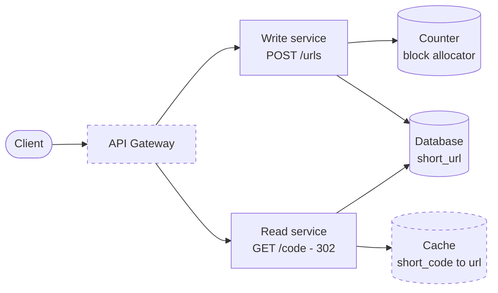

# URL Shortener + Agentic SDLC Orchestrator

Two things live here.

**A URL shortener** - create short links, follow them, expire them.

**An orchestrator** - takes a written requirement, walks it through the software
lifecycle with an AI agent doing the work at each stage, and stops for a human before
anything it cannot take back.

The shortener is the material. The orchestrator is the point. The clearest
demonstration is the orchestrator making a real change to the shortener: replacing one
short-code strategy with another, under approval.

---

## Running it

You need **Java 21** and **Maven 3.9+**.

```bash
git clone https://github.com/pratik1707/url_shortener_service.git
cd url_shortener_service
mvn spring-boot:run
```

Then open <http://localhost:8080>.

```bash
mvn verify          # all tests
```

Persistence is file-backed H2 under `./data`. That is deliberate - a run parked at an
approval gate is supposed to be able to wait, including across a restart.

---

## The shortener

### Why shorten a URL at all

A short link is not just a smaller string. Four things follow from putting a server
between the click and the destination:

- **It fits where the original does not.** SMS counts characters, print and QR codes have
  to be read by a human or a camera, and a 300-character tracking URL survives none of
  those. Six characters does.
- **The destination can change after the link is shared.** The printed link stays the
  same; where it points is a row in a table. A campaign page that moves does not
  invalidate a poster.
- **It can be revoked.** A link with a TTL stops working on its own. That is the reason
  for `410 Gone` rather than `404` - the link was real, and it has lapsed.
- **It can be counted.** Every click passes through us, so we can say how often a link was
  used, which is impossible once a browser has cached a permanent redirect.

The last two are why the redirect is `302`. A `301` would be faster and cheaper, and would
take the server out of the loop for every later click - which costs both the expiry
enforcement and the counting.

### Aliases

Callers can ask for their own code instead of a generated one:

```bash
curl -X POST localhost:8080/urls -H 'Content-Type: application/json' \
     -d '{"url":"https://internal.example.com/onboarding/2026/handbook","alias":"handbook"}'
# -> localhost:8080/handbook
```

A readable code is worth more than a short one when a person has to type it, say it aloud,
or decide whether to trust it: `example.com/handbook` reads as legitimate in a way
`example.com/W6bOLu` does not.

**Aliases are 7 to 16 characters, and that lower bound is a design decision rather than a
style choice.** Generated codes are always exactly 6. If a 6-character alias were allowed,
a caller could claim a code the counter has not reached yet - and the counter path
deliberately does not check whether a code is free before writing, because that skipped
lookup is the reason the counter was chosen. Keeping the two spaces from overlapping
preserves that property. The only clash still possible is one alias against another, and
that returns `409 Conflict` rather than quietly picking something else, because the caller
asked for that exact string.

### API

| | |
|---|---|
| `POST /urls` | `{ "url", "alias"?, "ttlSeconds"?, "createdBy"? }` → `201` with the short code |
| `GET /{code}` | `302` to the original, `404` unknown, `410` expired |
| `GET /urls/{code}/stats` | hit count, last access, expiry state |

```bash
curl -X POST localhost:8080/urls -H 'Content-Type: application/json' \
     -d '{"url":"https://www.example.com/a/long/path","ttlSeconds":3600}'

curl -i localhost:8080/W6bOLu

curl localhost:8080/urls/W6bOLu/stats
```

### Design

Reads outnumber writes heavily - a link is created once and followed many times - so
the two paths have different shapes. The write path mints a code and stores a row. The
read path is a primary-key lookup and a redirect, and is the one that has to be fast.

```
   client ──► POST /urls ──► UrlService ──► ShortCodeGenerator ──► counter
                                 │                                    │
                                 └──────────► short_url table ◄────────┘

   client ──► GET /{code} ──► UrlService ──► short_url ──► 302 Location
```

The short code is the **primary key**, so resolution is a PK hit rather than a
secondary index hit, and uniqueness is enforced by the database rather than by
application code.

**302, not 301.** A permanent redirect gets cached by the browser, which takes the
server out of the loop for every later click - no expiry enforcement, no ability to
retarget a link, no click data if analytics are added. The cost is that every click is
a request we serve. That is the right trade for a link that can expire.

**Expiry is enforced on read**, not by a sweeper deleting rows. A lapsed link is gone
the instant its TTL passes, with no job to fall behind, and the row survives for audit.
`410 Gone` rather than `404` because "this existed and has lapsed" is different
information from "this never existed."

### Short codes

Three approaches were considered; the comparison is in
[ADR-001](docs/adr/001-short-code-generation.md).

- **Prefix of the URL** - collides immediately. Rejected.
- **Hash** (`SHA-256` → base62) - stateless, but can collide, so every write needs a
  lookup to check the code is free plus retry on clash. Ships as
  `HashShortCodeGenerator`.
- **Counter** (increment → base62) - cannot collide, so no lookup and no retry. Six
  characters holds 56.8 billion codes. **Chosen.**

With one change. A raw counter maps `1, 2, 3` to `b, c, d`, so anyone holding one code
can walk the whole corpus. For a security-sensitive deployment that is not acceptable,
so the counter value passes through a **keyed, reversible permutation** before
encoding:

```
id    = counter value        // unique by construction
mixed = permutation(id)      // reversible, destroys ordering
code  = Base62.encode(mixed) // always 6 characters
```

A Feistel network is a bijection, so uniqueness survives the shuffle - that property is
asserted directly in `CodePermutationTest`. Consecutive ids come out unrecognisable:

```
1000 -> q3QFgA    1002 -> cUcosp    1004 -> 8Atmw7
1001 -> WMKilk    1003 -> IWKmmC    1005 -> gCmnAw
```

Both strategies sit behind `ShortCodeGenerator` and are selected by
`shortener.strategy` in `application.yml`. The write path does not know which is in
use - it only asks the generator whether a collision is possible and skips the lookup
when the answer is no.

### Counting clicks

Every redirect increments a counter on the row and stamps the access time, exposed at
`GET /urls/{code}/stats`. A request that serves nobody - an unknown code, or an expired
one - is not counted, because it was not traffic to that link.

The counter is incremented in the same transaction as the read. That is exact and simple,
and it puts a write on the read path: a genuinely popular link would contend on its own
row. At real volume this becomes a buffered counter flushed periodically, or a click event
streamed to something built for aggregation - trading exactness for throughput. For a
prototype that has to be correct and legible, the row is the right call, and the interface
does not change when it moves.

Nothing about who followed a link is stored. Counting clicks needs no identity.

### Scaling, as designed rather than as built

The target architecture, with the parts this prototype builds shown solid and the parts
it only designs for shown dashed:



| Component | In this prototype |
|---|---|
| API Gateway | Not built - one Spring Boot app, so there is nothing to route between yet |
| Write service | `POST /urls` -> `UrlService.create` -> `ShortCodeGenerator` |
| Read service | `GET /{code}` -> `UrlService.resolve` -> `302` |
| Counter | `CounterBlockAllocator` over an in-process `AtomicLong`; Redis `INCRBY` in production |
| Database | file-backed H2, `short_url` table keyed by short code |
| Cache | Not built - the read path is a pure key lookup, so a cache slots in front unchanged |

- **Counter across instances.** The prototype allocates blocks from an `AtomicLong`.
  Production uses Redis `INCRBY` behind the same `CounterBlockAllocator` interface.
  Instances take blocks of 1000, so Redis is consulted once per block rather than once
  per write, and a brief Redis outage does not stop writes. A block lost to a crash
  leaves a gap, which is harmless - the counter guarantees uniqueness, not density.
- **Read caching.** The read path is a pure key-value lookup, so a cache in front of it
  absorbs almost all traffic. Not built; it would change no interface.
- **Read/write split.** The two paths already have separate entry points and different
  scaling needs, so splitting them into separate services is a deployment change.

---

## The orchestrator

Give it a requirement. It plans the work, pauses for approval, then implements, tests
and documents in parallel where it can, pauses again before release - and falls back,
re-plans or rolls back when things do not go to plan.

```
   REQUIREMENTS
        │
     DESIGN
        │
    APPROVAL           ◄── human gate 1: approve the plan (or send it back with feedback)
      /     \
  IMPLEMENT  DOCS      ◄── run concurrently
      │        │
    TEST       │       ◄── retried, then fallback agent, bounded
      \       /
 RELEASE_APPROVAL      ◄── join + human gate 2: approve the release
        │
     RELEASE
```

This is a graph, not a pipeline, and the difference is load-bearing. IMPLEMENT and DOCS
have the same predecessor and no edge between them, so they run together.
RELEASE_APPROVAL depends on both TEST and DOCS, so it is a join that cannot start until
two independent branches have finished - and it is a second human gate, because
releasing is the most high-impact action in the run. `StageGraph` is validated acyclic
at startup.

### What keeps it under control

| | |
|---|---|
| **Approval gates** | Two: the plan, and the release. Nothing downstream of an unapproved decision runs. State is in the database, so the wait can be arbitrarily long. |
| **Entry and exit gates** | Entry: dependencies satisfied, then `PolicyGuard`. Exit: `StageExitCriteria` checks the output - a design with no rollback plan, or a test report that does not show 0 failed, counts as a failed attempt. |
| **Bounded retries** | Each stage gets `orchestrator.max-attempts` tries; the failure text is fed back into the next attempt. |
| **Fallback** | Retries used up → one attempt by `FallbackAgent`, which does less and says so (`FLAGGED` in its output, `fallback` in the console), so the release approver sees the degradation. |
| **Re-planning** | At a gate a human can send the run back with feedback (`/revise`). Every stage downstream of the changed one is invalidated and re-run, including gates already passed, and completed work is compensated first. Bounded by `orchestrator.max-revisions`. The plan also adjusts itself: a docs-only design takes IMPLEMENT and TEST out of the run. |
| **Rollback** | Fallback also fails → completed stages that changed something are reversed, in order. A half-applied change is worse than none. |
| **Safe stop** | An operator brake. Finished work stands, nothing further is scheduled. |
| **Policy guardrails** | Checked *before* a stage runs. A model asked nicely not to touch credentials is not a control; a check that refuses to start the stage is. |
| **Audit trail** | Append-only. Never updated, never deleted - a correction is a new row. That is what makes it evidence. |
| **Metrics** | Success rate, retry count, rollback rate, fallback count, re-plan count, MTTR, p50/p95 end to end - derived from stored runs, so they cannot drift from what happened. |

### API

| | |
|---|---|
| `POST /orchestrator/runs` | `{ "requirement", "scenario" }` → `202` with a run id |
| `GET /orchestrator/runs/{id}` | stages, statuses, outputs, full audit trail |
| `POST /orchestrator/runs/{id}/approve` | releases the gate the run is waiting at |
| `POST /orchestrator/runs/{id}/reject` | ends the run |
| `POST /orchestrator/runs/{id}/revise` | `{ "reason": feedback, "fromStage"? }` → re-plan from that stage (default DESIGN) |
| `POST /orchestrator/runs/{id}/stop` | safe stop |
| `GET /orchestrator/metrics` | reliability snapshot |
| `GET /orchestrator/graph` | the dependency graph |

### Agents

The work inside a stage sits behind the `Agent` interface. By default every stage uses
`StubAgent`, which returns deterministic stage artifacts, for three reasons: the graded
behaviour is the governance rather than the prose; the tests need determinism to assert
retry, fallback and rollback; and the reviewer should not need an API key.

A live model is included and off by default. `LlmAgent` calls the Anthropic Messages API
for REQUIREMENTS, DESIGN and DOCS - the stages whose output is free text:

```bash
export ANTHROPIC_API_KEY=...
ORCHESTRATOR_LLM_ENABLED=true mvn spring-boot:run
```

It goes through the same entry and exit gates, retries and fallback as the stub. If the
model's design leaves out the rollback plan, the exit gate sends it back with that reason;
if the API is down, the fallback agent finishes the stage and flags it. None of the
governance depends on the model behaving.

Reasoning and the full list of what was deliberately not built is in
[ADR-002](docs/adr/002-orchestrator-scope.md).

---

## Testing

```bash
mvn verify
```

| Area | What it proves |
|---|---|
| `Base62Test` | round trips, fixed width, rejects out-of-range values |
| `CodePermutationTest` | reversible, **no two ids collide**, consecutive ids are not neighbours |
| `ShortCodeGeneratorTest` | both strategies, and **16 threads generating at once with no duplicates** |
| `UrlEndToEndTest` | real HTTP: redirect, 404, 409 on alias clash, 410 on expiry, no-store |
| `UrlTtlAndStatsTest` | expiry over time, ttl on aliases, hit counting, expired hits not counted |
| `StageGraphTest` | acyclic, the parallel pair, the join, both gates, what a change invalidates |
| `StageExitCriteriaTest` | a design without rollback, requirements without acceptance, a failing test report are all sent back |
| `OrchestrationEngineTest` | parks at both gates, reject halts, **retry then recovers**, **fallback takes over**, **re-planning** from design and from requirements, re-planning compensates and is bounded, docs-only plan, policy blocks, safe stop, audit completeness |
| `LlmAgentTest` | the prompt carries upstream output, feedback and the last failure; reply parsing - offline, no key |

Two of those deserve emphasis. The counter's entire value is that it cannot collide, so
"sixteen threads, no duplicates" is the test protecting the reason the strategy was
chosen. And the permutation could silently reintroduce collisions, so its bijectivity is
asserted directly rather than assumed.

---

## Trade-offs and limitations

- **H2, not Postgres.** Chosen so the prototype runs anywhere in one command. JPA
  entities are portable; the datasource URL is the change.
- **In-process counter.** Correct within one JVM. Multi-instance needs the Redis
  allocator described in ADR-001.
- **Stub agents by default.** Deliberate, reasoned in ADR-002. The live model covers the
  three text stages; IMPLEMENT and TEST do not change real code.
- **Re-planning works within the graph.** Stages can be re-run or dropped from the plan;
  a run cannot add stage types the graph does not already have.
- **Analytics are a counter, not a pipeline.** Hit count and last access only; no time
  series, no referrer, no geography. The write sits on the read path, which is fine here
  and would not be at scale.
- **Single-node execution.** State is in the database, so distributing it needs a claim
  mechanism on runnable stages, not a redesign.
- **Rollback is logical.** Stages are marked reversed and audited; there is no VCS
  integration behind it.

---

## Working on this repo with an AI assistant

The assignment is about controlled autonomy, and that applies to how this repository is
changed too. `CLAUDE.md` holds the rules any AI assistant must follow here - build
commands, code style, and the invariants that are easy to break by accident. The skills in
`.claude/skills/` go deeper:

| Skill | Use it for |
|---|---|
| `url-shortener-domain` | the API contract, alias and TTL rules, redirects, code generation |
| `spring-boot-engineer` | adding or changing entities, repositories, DTOs, services, controllers |
| `spring-testing` | what kind of test to write, and what must never be weakened |
| `orchestrator-governance` | changing stages, gates, agents, retries, fallback, re-planning |
| `grill-me` | questions to settle before writing code for a significant change |

---

## Layout

```
src/main/java/com/schwab/shortener/
  url/            entity, service, controller, error handling
  url/codec/      Base62, permutation, both generator strategies
  orchestrator/   graph, engine, agents, policy, audit, metrics, API
src/main/resources/static/index.html    the console
docs/adr/         decision records
docs/CHANGELOG.md what changed between versions
CLAUDE.md, .claude/skills/   rules and skills for AI assistants working here
```
